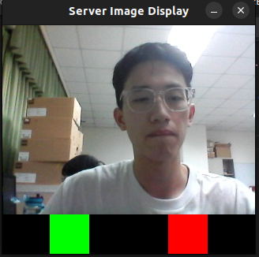

# TCP/IP Photo Transfer Program
- This is a front/back camera photo transfer program using TCP/IP protocol.

- Can use **multithreading** to transfer a photo to multiple clients at the same time.
- Use SDL2 to display the photo and can use the mouse to click the red or green bottom to decide whether to alarm.

## Result Image

